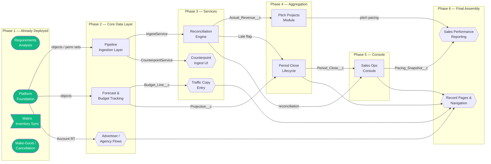

# Project Brief

## Goals
- Deliver a unified local advertising sales platform on Salesforce covering the full lifecycle: account/taxonomy MDM, AE projection capture, contract/budget execution, traffic order entry, reconciliation of inbound actuals, period close, and executive reporting — replacing today's fragmented spreadsheet-and-email workflow across 5 source billing systems.
- Ingest and reconcile inbound revenue from all five external traffic/billing systems (WideOrbit, Strata, CoxReps, Operative, Counterpoint) via a single canonical `SourceSystemTransformer` interface with idempotent upsert on `Inbound_Staging__c.Composite_Key__c`, achieving ≥95% auto-match rate through the three-tier `AccountMatcher` and five-tier self-healing `SalespersonMatcher`.
- Produce a defensible monthly close and variance-reporting capability: `Period_Close__c` state machine with atomic `Period_Snapshot__c` capture of Projected_At_Close vs Actual_At_Close, supporting forecast-accuracy reporting and re-open governance.
- Deliver a Sales Operations Console with daily `Pacing_Snapshot__c` (weighted Won×1.0/Committed×0.6/Pitched×0.3/Working×0.1 from `Forecast_Stage_Weight__mdt`), 'The Bible' extract blending Booked/Last Year/Forecast/Budget, and the six-tab operational app for Load Batches, Reconciliation, MDM Queue, Late Actuals, Period Close, and Exclusion Log.
- Maintain ≥75% Apex line coverage org-wide (90%+ on services and batches), enforce bulkified one-trigger-per-object handlers, and deploy each slice through `clare-dev` → `clare-uat` → Production with explicit in-chat confirmation gating production cuts.

## Non-goals
- Epic 9 (Data Migration) — no migration scripts, ETL, or legacy backfill is in scope until a separate discovery session is held; Univision_Field_Manifest reconciliation against standard Opportunity is the only data-shape work currently authorized.
- Outbound traffic order transmission — `TrafficOrderTransmitQueueable` and the `callout:Traffic_System` named credential are built but **out of Phase 1 SOW**; deployment to UAT/Production requires a Change Order.
- Make-Good/Cancellation, Local Ad Sales Proposal Flow, and the Contract approval process — exist on feature branches but are also out of original SOW; client-facing deployment blocked pending Change Orders.
- Recreation of the deleted `ITransformer` interface or any parallel ingest abstraction — `SourceSystemTransformer` + `TransformerRegistry` is the only sanctioned routing path.

## Architecture
The data model is anchored on a six-object spine: standard `Opportunity` (Advertising_Opportunity__c was retired 2026-05-04 per FIELD_MAPPING.md) is parent to `Advertising_Contract__c` (Master-Detail), which parents `Budget_Line__c` for spot-level traffic and copy entry. `Vehicle__c` and its `Vehicle_Channel__c` junction model inventory groupings; `Account` is extended with HoldCo/Agency/Advertiser/Direct_Buy record types and joined to `Category__c` via the `Account_Category__c` junction for taxonomy rollup. Forecasting runs on `Projection__c` (composite-keyed AE+Category+Period) and `Budget__c` (Account/Category/Revenue_Type/Period_Year), governed by `Budget_Lock__c` at six scope levels. Sharing for Account/Projection/Budget is Private OWD with role-hierarchy rollup to isolate competitive HoldCo/Agency/Advertiser data while preserving manager visibility.

Inbound revenue lands in `Inbound_Staging__c` (13-field, ExternalId-keyed) via `IngestService.orchestrate()` → `TransformerRegistry` → one of five `SourceSystemTransformer` implementations. The `ReconciliationEngine.reconcileBatch()` is the single entry point for matching, writing immutable `Actual_Revenue__c` records (with frozen `Category_Snapshot__c`) and `Reconciliation_Line__c` audit links. Triggers are one-per-object delegating to `*TriggerHandler` classes; all callouts are isolated to Queueables (`TrafficOrderTransmitQueueable`, `MatrixInventorySyncQueueable`); 2,000+-row work runs through `Database.Batchable` (`ReconciliationBatch`, `PacingSnapshotBatch`).

UI is delivered through Lightning Web Components and Screen Flows with `@InvocableMethod` bridges. Key LWCs include `aeProjectionGrid` (paste-from-Excel projection capture), `accountBudgetGrid`, `categoryTreeManager`, `mdmKpiTiles`, `pitchProjectCreator`/`pitchProjectPacing`, `salesOpsKpiDashboard`, `bibleExtract`, `financialReportBuilder`, `periodCloseActions`, `lateActualsWorklist`, and `periodCloseDashboard`. All Screen Flows surfacing as quick actions terminate on a Confirmation Screen and call Apex only via Invocable Actions. Integrations: nightly Matrix API sync (configurable hour via `Matrix_Sync_Config__mdt`, audited to `Matrix_Sync_Log__c`), the five inbound CSV/file feeds, and the deferred outbound traffic transmission. Deployment is dependency-ordered through ten `agent/<slice-name>` branches; production deploys are git-push-only via GitHub Actions (the ka-vault hook blocks direct `sf deploy` to the `clare.segrue@kelleyaustin.com` production org).

## Target users
See docs/Personas.md for full persona detail.

- Account Executive (AE) — owns Projections, Pitch Projects, and pacing against quota; primary user of `aeProjectionGrid` and pitch LWCs.
- Sales Operations Analyst — runs the Sales Ops Console, monitors load batches, drives reconciliation exception queues and 'The Bible' extract.
- Traffic Coordinator — enters copy/spot detail on `Budget_Line__c`, manages `Traffic_Coordinator` permission set workflows.
- MDM Curator / Data Steward — maintains Account hierarchy, `Category__c` taxonomy, and resolves manual-match queue items.
- Sales Manager — consumes weighted pacing, forecast-accuracy, and dashboard suites; needs role-hierarchy visibility into team pipeline.
- Sales Rep (general) — limited-scope account creation only, gated by the `Sales_Rep` permission set.
- Finance / Period Close Owner — executes `Period_Close__c` transitions, reviews `Period_Snapshot__c` variance, governs reopen approvals.
- Pitch Project Lead (Corporate or Market) — owns multi-outlet pitches via `Pitch_Project__c` and the outlet junction.

## Slice index

| Slice | Status | Doc | Persona served |
|---|---|---|---|
| Platform Foundation | deployed | [docs/slices/platform-foundation.md](docs/slices/platform-foundation.md) | MDM Curator, all users (perm sets) |
| Matrix Inventory Sync — Vehicle & Media Plan IDs | ready-to-start | [docs/slices/matrix-inventory-sync.md](docs/slices/matrix-inventory-sync.md) | Sales Ops Analyst, Traffic Coordinator |
| Pipeline Ingestion Layer — 5 Source Transformers | deployed | [docs/slices/pipeline-ingestion-layer.md](docs/slices/pipeline-ingestion-layer.md) | Sales Ops Analyst |
| Forecast Management & Budget Tracking | deployed | [docs/slices/forecast-management-budget-tracking.md](docs/slices/forecast-management-budget-tracking.md) | Account Executive, Sales Manager |
| Advertiser & Agency Account Flows | deployed | [docs/slices/advertiser-agency-flows.md](docs/slices/advertiser-agency-flows.md) | Sales Rep, MDM Curator |
| Reconciliation & Actual Revenue Engine | deployed | [docs/slices/reconciliation-engine.md](docs/slices/reconciliation-engine.md) | Sales Ops Analyst, AE |
| Counterpoint Ingest UI (Screen Flow + LWC upload) | deployed | [docs/slices/counterpoint-ingest-ui.md](docs/slices/counterpoint-ingest-ui.md) | Sales Ops Analyst |
| Traffic Copy Entry & Order Transmission Flow | in-progress | [docs/slices/traffic-copy-entry.md](docs/slices/traffic-copy-entry.md) | Traffic Coordinator |
| Make-Good & Cancellation Request Workflow | deployed | [docs/slices/makegood-cancellation.md](docs/slices/makegood-cancellation.md) | AE, Sales Manager |
| Pitch Projects Module | ready-to-start | [docs/slices/pitch-projects-module.md](docs/slices/pitch-projects-module.md) | Pitch Project Lead, AE |
| Period Close Lifecycle & Variance Reporting | in-progress | [docs/slices/period-close-lifecycle.md](docs/slices/period-close-lifecycle.md) | Finance / Period Close Owner |
| Sales Operations Console & Reporting Analytics | in-progress | [docs/slices/sales-ops-console.md](docs/slices/sales-ops-console.md) | Sales Ops Analyst, Sales Manager |
| Sales Performance Reporting & Dashboard Suite | in-progress | [docs/slices/sales-performance-reporting.md](docs/slices/sales-performance-reporting.md) | Sales Manager, AE |
| Lightning App Record Pages & Navigation Assembly | in-progress | [docs/slices/record-pages-navigation.md](docs/slices/record-pages-navigation.md) | All users |
| Preempt Transition Service & Forecast Lifecycle | in-progress | [docs/slices/preempt-forecast-lifecycle.md](docs/slices/preempt-forecast-lifecycle.md) | AE, Sales Ops Analyst |
| Field Manifest Reconciliation Against Standard Opportunity | ready-to-start | [docs/slices/field-manifest-reconciliation.md](docs/slices/field-manifest-reconciliation.md) | MDM Curator, dev team |
| Internal Action Items Triage & Cutover Sync | ready-to-start | [docs/slices/internal-action-items-triage.md](docs/slices/internal-action-items-triage.md) | Project Manager, MDM Curator |
| Solution Design Document v1.0 Gap Closure | ready-to-start | [docs/slices/sdd-v1-gap-closure.md](docs/slices/sdd-v1-gap-closure.md) | Solution Architect |
| Internal Meeting Notes → Decision Log Extraction | ready-to-start | [docs/slices/meeting-notes-decision-log.md](docs/slices/meeting-notes-decision-log.md) | Project Manager |

## Risks & open questions
- (2026-05-05) Epic 2 ingestion layer has a known compile conflict per the SOW Gap Analysis (April 2026); blocker for any new transformer work until resolved — owner and target date unconfirmed.
- (2026-05-05) Epic 9 Data Migration is unstarted and unscoped; no discovery session is on the calendar. Production cutover cannot proceed without a migration plan, source extracts, and a dry-run rehearsal.
- (2026-05-05) Three SOW-deferred features (Traffic outbound callout, Make-Good/Cancellation, Local Ad Sales Proposal Flow) are built and on branches but require Change Orders before UAT/Prod deploy — risk of accidental deployment if branch hygiene slips.
- (2026-05-05) `Advertising_Opportunity__c` was retired on 2026-05-04 (commit 9db1aa9) and replaced with standard `Opportunity`; FIELD_MAPPING.md is the canonical cross-walk but downstream slices, reports, and LWCs may still reference the deleted object — Field Manifest Reconciliation slice must complete before any further deploys.
- (2026-05-05) Three custom report types and incomplete deploy artifacts are flagged in the SOW gap analysis; reporting suite cannot be fully wired until those report types exist in metadata.
- (2026-05-05) Multiple parallel integration branches exist (matrix-inventory-sync, period-close-*, reconciliation-actual-revenue-engine, claresegrue-prft-developer) that are superseded but not deleted; risk of merging stale work — branch cleanup pending.
- (2026-05-05) `PreemptTransitionService` (3-008) and Stage 0–5 forecast lifecycle (3-009) have specs in CLAUDE.md/SLICES.md but no implementation and no `agent/reconciliation-preempt-forecast` branch exists; ownership and start date unassigned.
- (2026-05-05) Production deploy path depends on the ka-vault hook + GitHub Actions pipeline; failure mode if Actions is down or the hook misconfigures is undocumented — need a runbook for the production deploy owner.
- (2026-05-05) Sandbox topology in CLAUDE.md lists `clare-dev`, `clare-uat`, and Production but project memory records only `univision-production` (a Developer Edition org) as the actual connected target — the documented org strategy and the real connections diverge and need reconciliation before UAT testing begins.
- (2026-05-05) `clare-uat` partial-copy refresh cadence is undefined; risk of stale UAT data masking reconciliation/matching defects that only surface against production-scale data volumes.
